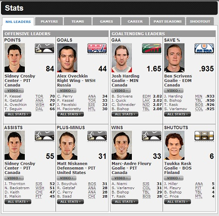
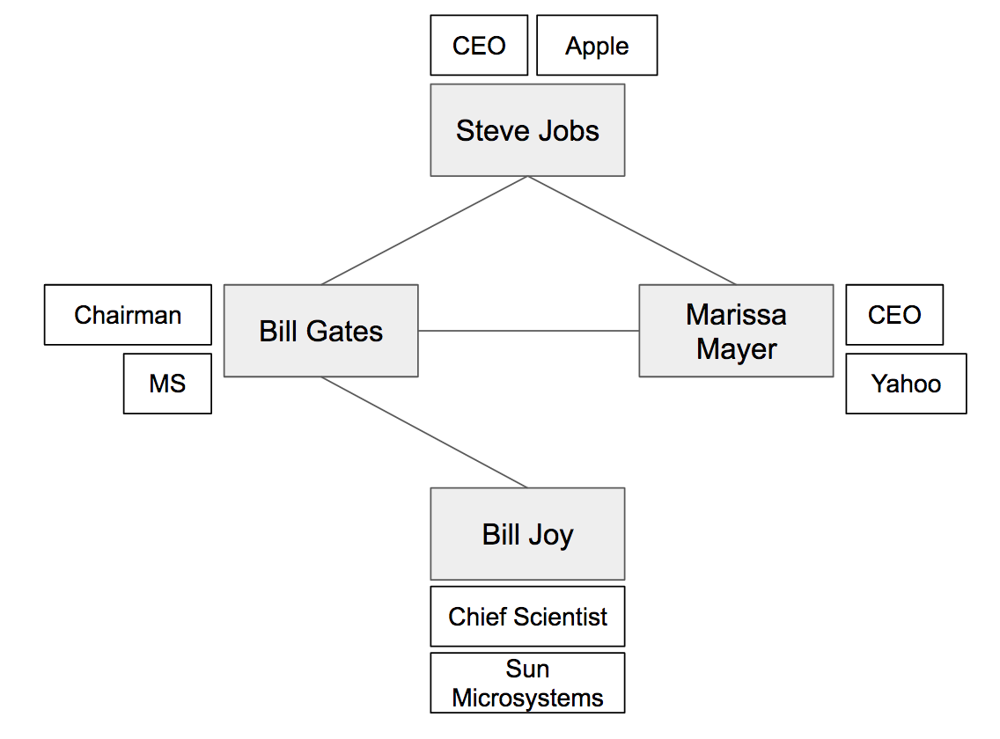

+++
title = "Tables everywhere"
categories = ["database"]
+++

# Tables everywhere

[!](highlight)

# The first McDonald's ledger, 1959

</img>

[!](note)
The sales ledger from Lou Groen’s opening day of business, January 13, 1959, at
his first McDonald’s in Monfort Heights, Ohio. Image courtesy of Paul Groen.

# New York City Burial Record, 1830

</img>

[!](note)
The Original Ledger of Burial Records, New York Marble Cemetery.
[Original source](https://greenwichvillagehistory.wordpress.com/2012/11/13/)

# Tycho Brahe's Star Catalog, 1602

</img>

[!](note)
By 1592, Tycho had produced a catalogue of 777 stars, the first new catalogue
known to the Latin West since the time of Ptolemy. This catalogue was printed
for inclusion in the Astronomiae instauratae progymnasmata.

# Hockey Statistics, 2014

</img>

[!](note) NHL players of 2014

# Ebola clinical records, 2015

</img>

[!](note fragment) Tracking cases at the Liberian Ministry of Health and Social Welfare.
[Original source](http://motherboard.vice.com/read/ebolas-paper-trail)

What's in common?
========================================================

Tabular layout

# Tables

[!](highlight)

Terminologies
========================================

[!](columns 6:)

City | Province | Population |
-----|----------|------------|
Oshawa | Ontario | 140,000 |
Toronto | Ontario | 2,600,000 |
Montreal | Quebec | 1,600,000 |
Clarington | Ontario | 84,000 |
Paris | Ontario | 11,000 |
Brooklin | Ontario | NULL |

[!](split)

*Some definitions:*

- [!](fragments)
- Table (relation)
- Attributes (columns)
- Tuples (rows)
- Values (cell)

Table
==============================

[!](columns 6:)

City | Province | Population |
-----|----------|------------|
Oshawa | Ontario | 140,000 |
Toronto | Ontario | 2,600,000 |
Montreal | Quebec | 1,600,000 |
Clarington | Ontario | 84,000 |
Paris | Ontario | 11,000 |
Brooklin | Ontario | NULL |

[!](split)

This is a table.  It consists of

- three attributes
- six tuples
- 17 data values, and one missing value.

Attribute
=================================

An _attribute_ is a column in a table.  It consists

- a name
- a data type.

[!](columns 5:)

City | Province | Population |
-----|----------|------------|
... | ... | ... |

[!](split)

- There are three attributes.
- The first attribute is `City`, and its data type is `string`.
- The last attribute is `Population`, and its data type is `integer`.

Tuple
=================================

A tuple is a row of data in a table.

[!](columns 6:)

<table>
    <thead>
    <tr>
        <th>City</th>
        <th>Province</th>
        <th>Population</th>
    </tr>
    </thead>
    <tr style=background:#a6a>
        <td>Paris</td>
        <td>Ontario</td>
        <td>11,000</td>
    </tr>
    <tr style="background: #afa">
        <td>Brooklin</td>
        <td>Ontario</td>
        <td>NULL</td>
    </tr>
</table>

[!](split)

Two tuples

# _____________________________________

[!](columns 6:)

<table>
    <thead>
    <tr>
        <th>City</th>
        <th>Province</th>
        <th>Population</th>
    </tr>
    </thead>
    <tr style=background:#a6a>
        <td>Paris</td>
        <td>Ontario</td>
        <td>11,000</td>
    </tr>
    <tr style="background: #afa; opacity: 0.1">
        <td>Brooklin</td>
        <td>Ontario</td>
        <td>NULL</td>
    </tr>
</table>

[!](split)

This tuple has three values.

[!](note 6) Can it have four values?

# _____________________________________

[!](columns 6:)

<table>
    <thead>
    <tr>
        <th>City</th>
        <th>Province</th>
        <th>Population</th>
    </tr>
    </thead>
    <tr style=background:#a6a;opacity:0.2>
        <td>Paris</td>
        <td>Ontario</td>
        <td>11,000</td>
    </tr>
    <tr style="background: #afa">
        <td>Brooklin</td>
        <td>Ontario</td>
        <td>NULL</td>
    </tr>
</table>

[!](split)

This tuple has two values, as the value for the attribute **population** is
*missing*.

Data Modeling
========================================

[!](highlight)

Data Modeling
========================================

- Data in real-life scenarios:

    For example:

    > 1. Student records
    > 2. Google map
    > 3. Network traffic

> [!](box fragment)
> *Data Modeling*
> 
> The data must be stored in a lossless form.  Designing the layout and storage
> of data based on the real-life scenario is called *data modeling*.

Case study: a social graph as tables
=========================================

[!](columns 6:)

</img>

[!](split)

Here is a simple social graph between four individuals.

How do we encode this as one or more tables?

# ___________________

[!](columns 6:)

</img>

[!](split)

| person | knows |
|--------|-------|
| Steve Jobs | Marissa Mayer |
| Steve Jobs | Bill Gates    |
| Bill Gates | Marissa Mayer |
| Bill Gates | Bill Job      |

[!](***)

It's important to note that this is a _lossless_ encoding of the social graph.

# ________________________

[!](columns 8:)

</img>

[!](split)

How do we model the additional information of the augmented social graph?

# ___________________________

[!](scale 0.9)

[!](columns 5:)

</img>

[!](split)

Use more tables [!](box)

Table: *Knows*

| person | knows |
|--------|-------|
| Steve Jobs | Marissa Mayer |
| Steve Jobs | Bill Gates    |
| Bill Gates | Marissa Mayer |
| Bill Gates | Bill Joy      |

Table: *Position*

| person | position | company |
|--------|----------|---------|
| Steve Jobs | CEO | Apple |
| Marissa Mayer | CEO | Yahoo |
| Bill Gates | Chairman | Microsoft |
| Bill Joy | Chief Scientist | SUN Microsystems |

# ___________________________

What if we use one table? [!](box)

[!](columns 7:)

Table: *Knows-and-position*

| person | position | company | knows |
|--------|----------|---------|-------|
| Steve Jobs | <red>CEO</red> | <red>Apple</red> | Marissa Mayer |
| Steve Jobs | <red>CEO</red> | <red>Apple</red> | Bill Gates |
| Bill Gates | <blue>Chairman</blue> | <blue>Microsoft</blue> | Marissa Mayer |
| Bill Gates | <blue>Chairman</blue> | <blue>Microsoft</blue> | Bill Joy |
| Marissa Mayer | CEO | Yahoo | <blue>NULL</blue> |
| Bill Joy | Chief Scientist | SUN Microsystems | <blue>NULL</blue> |

[!](split)

Forcing everything to be stored as a single table causes some issues:

1. Data redundancy: <red>CEO</red> and <red>Apple</red> are storied multiple
times just because `Steve Jobs` knows lots of people.

2. <blue>NULL</blue> values are used for `Marissa Mayer` and `Bill Joy`.

# _______________________________

Let's summarize the data model:

> - [!](comfortable)
> - We will use two tables.
> 
> - Table *Knows* will have two attributes:
> 
>     - person: text
>     - knows: text
> 
> - Table *Position* will have three attributes:
> 
>     - person: text
>     - position: text
>     - company: text

Summary
==============================================

[!](highlight)

- Tables

- Attributes

- Tuples

- Values (data and missing)

- Data modeling
